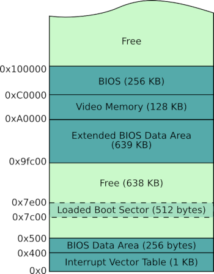

# The Boot Process & Boot Sector

After the computer powered on, the BIOS program will loaded into memory and do some low-level test of the hardware, then load the boot sector of operating system into memory to execution. 

But There is a problem that how the BIOS know where the boot sector is. The easiest place to find, the first sector in disk is known as boot sector was adopted by BIOS. 

But still has a problem that how the BIOS know the bytes in boot sector is the crafted boot code. (Note that there is no difference between code and data for the CPU) Again, in the simplest way, the last two bytes are magic number 0xaa55 is the boot sector is adopted by BIOS.

So, the boot process can be summarized as

+ Load BIOS into memory
+ BIOS complete some low-level test of the hardware
+ BIOS Load the boot sector of operating system into memory (actually at 0x7c00, make sure it doesn't cover other important routines provided by BIOS, we will use it later)
+ Execute the code in boot sector (Now we get the control of the computer from BIOS)

Typical lower memory layout after boot (referenced by **Writing a Simple Operating System—from Scratch**)



You can download this book, get more OS development resources from my github
[https://github.com/geekaaron/Resources](https://github.com/geekaaron/Resources)

Now we can write a simple boot sector by at&t assembly that just perform an endless loop.

```
	# Booting from 16-bit real mode because of backward compatible
	.code16

	# text section - contains pure binary code of this program
	.section .text

	.global _bootsect
	
	_bootset:

	# endless loop
	hold:
		jmp hold
		
	# Padding to 510 bytes with 0
	.= 510
	
	# magic number of boot sector
	magic_number:
		.byte 0x55, 0xaa
```

You might be wondering why the magic number is 0x55, 0xaa in the code above. This involves the endianness adopted by computer. The little-endian was used in x86 architecture. I will list the concept of little-endian and big-endian below.

+ **Little-endian** - Little endian number is ordered from the least significant byte (LSB) in low memory address to the most significant byte (MSB) in high memory address.
+ **Big-endian** - Big endian number is ordered from the most significant byte (MSB) in low memory address to the least significant byte (LSB) in high memory address.

*See more* [https://www.rapidtables.com/prog/endianess.html](https://www.rapidtables.com/prog/endianess.html)

You can complie the code above by GNU tools `as` and `ld` and use `objcopy` to extrac the .text section (Note that, the boot sector must contains pure binary code for CPU execution), then use `qemu` to test it:

```
$ as --32 -o bootsec.o bootsect
$ ld -Ttext 0 -e _bootsect -m elf_i386 -s -o bootsect bootsect.o
$ objcopy -O binary -j .text -S bootsect image
$ qemu-system-i386 -boot a -fda image
```

#### as

+ --32 - i386 target
+ -o - output file

#### ld

+ -Ttext 0 - specify the text section start at 0
+ -e _bootsect - entry point is _bootsect
+ -m elf_i386 - elf i386 target
+ -s - strip all symbol information from output file
+ -o - output file

#### objcopy

+ -O binary - generate a raw binary file
+ -j .text - only output .text section (the pure code section we need)
+ -S - strip all relocation and symbol information from the source file

Type `man xxx` on your Linux to see more details about these commands, xxx is the name of command.

It works If your `qemu` simply hangs, without the messege such as "No bootable device here".

If you want to run it inside bochs, you need to write a bochs configuration file as `bochsrc`

```
floppya: 1_44 = "./image", status = inserted
boot: floppy
```
