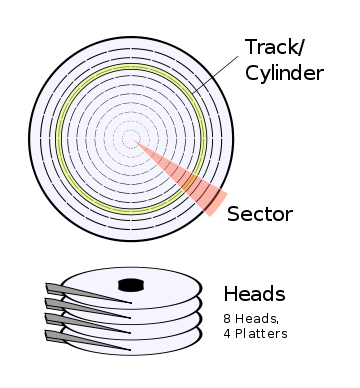

# Disk Addressing & Using BIOS to Read Disk

Usually the operating system size is much larger than 512 bytes. It means we have to read the rest of OS from some storage (e.g. floppy, hard disk, etc) into memory. So how do we read the rest from disk in 16-bit real mode? To know this, we need to know disk addressing (i.e. How to describe the exact place in stacked up platters) first. The Cylinder-Head-Sector (CHS) addressing is used for it.

Here are the concepts about C, H, S (referenced by **Writing a Simple Operating System—from Scratc**):

+ Cylinder: the cylinder describes the head's discrete distance from the outer edge of the platter and is so named since, when several platters are stacked up, you can visualise that all of the heads select a cylinder through all of the platters.
+ Head: the head describes which track (i.e. which specific platter surface within the cylinder) we are interested in.
+ Sector: the circular track is divied into sectors, usually of capacity 512 bytes which can be referenced with a sector index.

You can download this book, get more os development resources from my github [https://github.com/geekaaron/Resources](https://github.com/geekaaron/Resources)

**Figure**: Cylinder, Head, sectors structures of hard disk



**Example**:  A "1.44 MB" floppy disk has 80 cylinders (numbered 0 to 79), 2 heads (numbered 0 to 1) and 18 sectors (numbered 1 to 18). Therefore, its capacity in sectors is computed as follows:

Total sectors = 80 * 2 * 18 = 2880 --> 2880 * 512 bytes/sector = 1.44 MB


*See more* [http://www.thefullwiki.org/Cylinder-head-sector](http://www.thefullwiki.org/Cylinder-head-sector)

Now we assume that we want to read the first sector after the boot sector (i.e. 0-0-2 CHS. Note cylinder and head number starting from 0, sector number starting from 1) into 0x90000, we can using BIOS interrupt routine to read it, as detailed in next code snippet.

```
load_demo:
	mov $0x9000, %ax	# Use ax register to change es segment register
	mov %ax, %es		# Set es to the segment of demo
	mov $0, %bx		# bx=0 -> offset=0; es:bx -> 0x9000:0000 = 0x90000
	mov $0x0200+1, %ax	# int=0x13/ah=0x02 -> Read disk sectors; al=1 -> Read 1 sector
	mov $0x0002, %cx	# ch=0 -> Cylinder 0; cl=2 -> sector number 2
	mov $0x0000, %dx	# dh=0 -> head number 0; dl=0 -> drive number 0 (floppy disk)
	int $0x13		# Read 1 sector from 0-0-2 (CHS) in floppy to 0x90000
```

But how do we know if we actually read the sector from floppy disk? BIOS will updates some register after interrupt routine to let us know what happend:

+ The carry flag (CF) will be set to 1 if read disk failed.
+ The al register contains the number of sectors we actually read.

So do some simple check after read the disk, as detailed in next code sinppet.

```
	jc reset_disk		# Read failed if cf=1

	cmp $1, %al		# if al (number of sectors actually read) = 1 (we need to read)
	je load_demo_done	# demo load successful

reset_disk:
	mov $0, %ah		# int=0x13/ah=0 -> Reset disk system
	mov $0, %dl		# dl=0 -> drive number 0 (floppy disk)
	int $0x10		# Reset disk stat
	jmp load_demo		# Load demo again

```